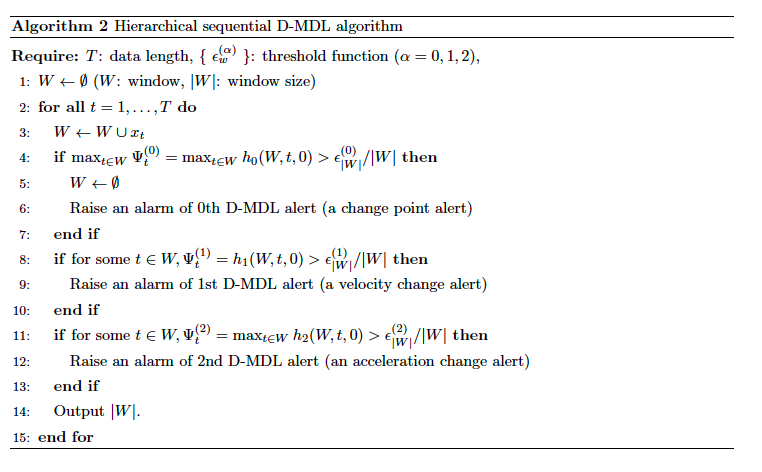

# Differential MDL Change Statistics

## 1. About
This repository contains the implementation code of differential MDL change statistics (D-MDL) [1].
An alert system for COVID-19 change sign detection using the differential MDL change statistics has been made open in public.
https://ibarakikenyukishi.github.io/d-mdl-html/index.html

## 2. Environment
- CPU: 2.7 GHz Intel Core i5
- OS: macOS High Sierra 10.13.6
- Memory: 8GB 1867 MHz DDR3
- python: 3.6.4. with Anaconda.

## 3. How to Run
### Data Preparation
1. Download the data in xlsx format from the link below:
https://www.ecdc.europa.eu/en/publications-data/download-todays-data-geographic-distribution-covid-19-cases-worldwide

2. Rename the file to `covid_data.xlsx` and put it in `./data/covid_data.xlsx`.

### RUN
- Run the jupyter file at `./jupyter/symptom/D-MDL_SCAW_Exponential.ipynb` for the exponential modeling
- Run the jupyter file at `./jupyter/symptom/D-MDL_SCAW_Gaussian.ipynb` for the Gaussian modeling
- Run the jupyter file at `./jupyter/synthetic/synthetic_{abrupt,gradual}_{mean,variance}.ipynb` for the synthetic datasets

## 4. Author & Mail address
- Ryo Yuki (jie-cheng-ling@g.ecc.u-tokyo.ac.jp)
- Linchuan Xu (linchxu@comp.polyu.edu.hk)
- Shintaro Fukushima (shintaro_fukushima@mist.i.u-tokyo.ac.jp)

## 5. Requirements & License
### Requirements
- numpy==1.15.0
- scipy==1.3.1

### License
This code is licensed under MIT License.

## 6. Note
The results of Gaussian and exponential modeling changed may be slightly different from those in the paper because the dataset of past dates was updated day-by-day.

The NML code length of exponential modeling was calculated with the example 3 in [2].

## 7. Modification of Algorithm 2
Algorithm 2 states that when a change is detected, it drops the data ealier than the time point in which 0th D-MDL is maximized. However, according to the study [3], all of the content should be dropped so that the total number of false alarms is finite (i.e., asymptotic reliability). Therefore, we modify Algorithm 2 as follows:

## 8. Reference
1. Yamanishi, K., Xu, L., Yuki, R., Fukushima, S., & Lin, C. H. (2021). Change sign detection with differential MDL change statistics and its applications to COVID-19 pandemic analysis. Scientific reports, 11(1), 1-15.
2. Yamanishi, K., & Miyaguchi, K. (2016, December). Detecting gradual changes from data stream using MDL-change statistics. In 2016 IEEE International Conference on Big Data (Big Data) (pp. 156-163). IEEE.
3. Kaneko, R., Miyaguchi, K., & Yamanishi, K. (2017, December). Detecting changes in streaming data with information-theoretic windowing. In 2017 IEEE International Conference on Big Data (Big Data) (pp. 646-655). IEEE.
